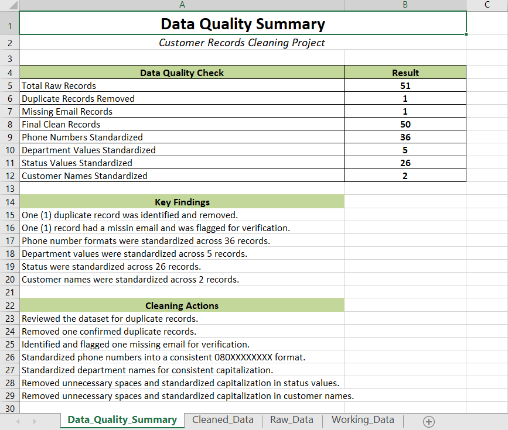
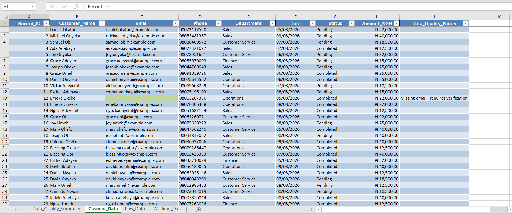

# Customer Records Data Entry & Data Cleaning

## Project Overview

This project simulates a real-world customer records data entry and data quality task using Microsoft Excel.

The objective was to review, clean, standardize, validate, and document issues identified in a customer dataset while preserving the original data.

## Dataset

The dataset contained 51 customer records and included information such as:

- Record ID
- Customer Name
- Email
- Phone Number
- Department
- Date
- Status
- Amount

## Data Quality Issues Identified

The following issues were identified during the review:

- 1 duplicate record
- 1 missing email address
- Inconsistent phone number formats
- Inconsistent capitalization in department names
- Inconsistent capitalization and unnecessary spaces in status values
- Unnecessary spaces and inconsistent capitalization in customer names

## Cleaning & Validation Process

The dataset was processed using Microsoft Excel.

Key steps included:

1. Reviewed the dataset for data quality issues.
2. Identified duplicate records using Excel formulas and duplicate checks.
3. Removed the confirmed duplicate record.
4. Flagged the missing email address without inventing or altering the missing information.
5. Standardized phone numbers into a consistent format.
6. Standardized department names using text functions.
7. Removed unnecessary spaces and standardized status values.
8. Cleaned customer names by removing unnecessary spaces and standardizing capitalization.
9. Created validation checks to compare original and cleaned values.
10. Created a Data Quality Summary documenting the cleaning results.

## Results

| Data Quality Check | Result |
|---|---:|
| Total raw records | 51 |
| Duplicate records removed | 1 |
| Missing email records | 1 |
| Final clean records | 50 |
| Phone numbers standardized | 36 |
| Department values standardized | 5 |
| Status values standardized | 26 |
| Customer names standardized | 2 |

## Workbook Structure

The Excel workbook contains four sheets:

- **Data_Quality_Summary** – summarizes the issues identified and actions taken.
- **Cleaned_Data** – contains the final cleaned dataset.
- **Raw_Data** – preserves the original dataset.
- **Working_Data** – contains formulas and intermediate cleaning steps used during the process.

## Tools & Skills

**Tool:** Microsoft Excel

**Skills demonstrated:**

- Data entry
- Data cleaning
- Data validation
- Duplicate detection
- Missing data identification
- Text standardization
- Excel formulas
- Quality control
- Data documentation

## Key Learning

This project reinforced the importance of validating data rather than relying only on visual inspection. Several issues, including unnecessary spaces and capitalization differences, were not immediately obvious and required formula-based checks to identify.

## Project Preview

### Data Quality Summary

### Cleaned Dataset

